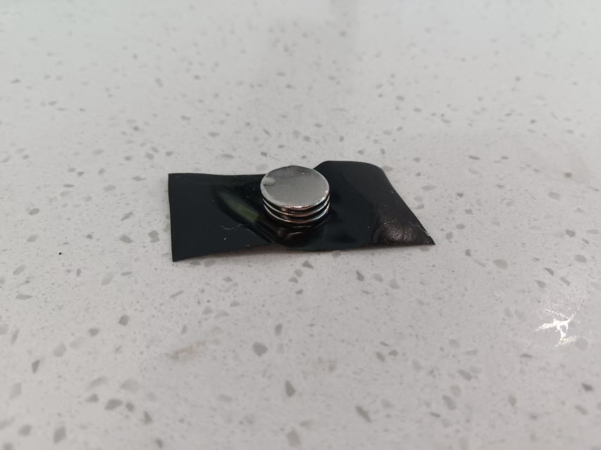
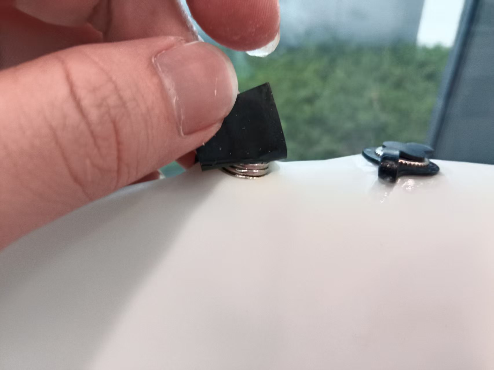
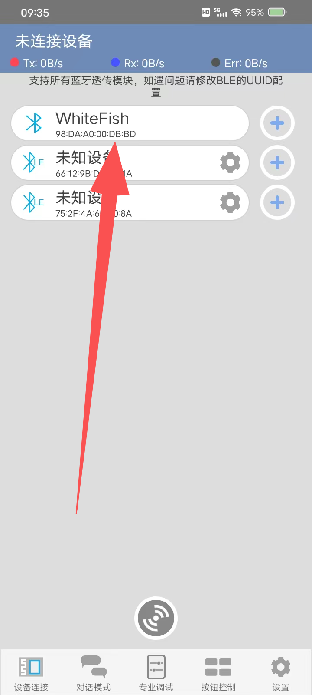
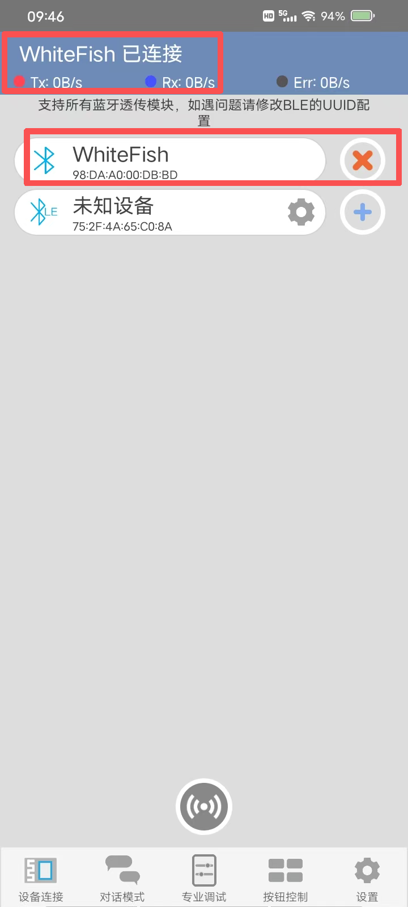
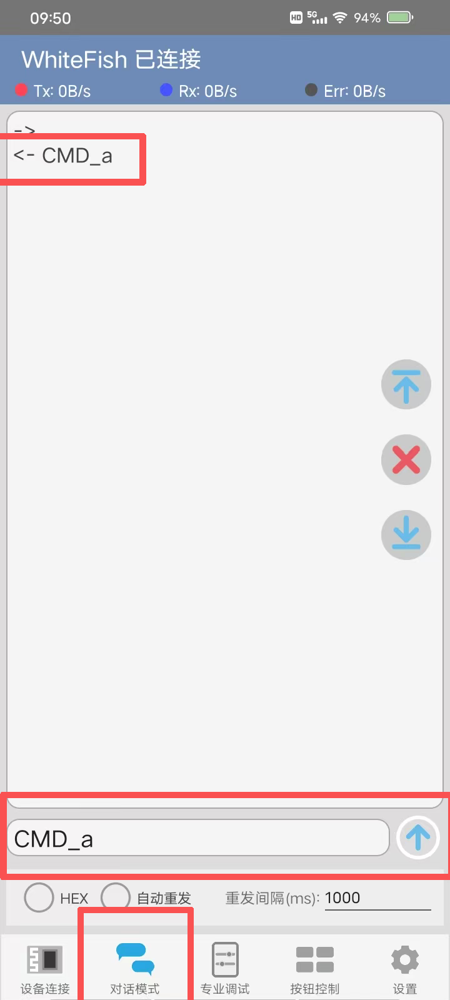
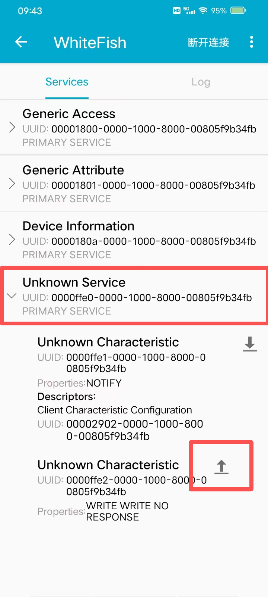
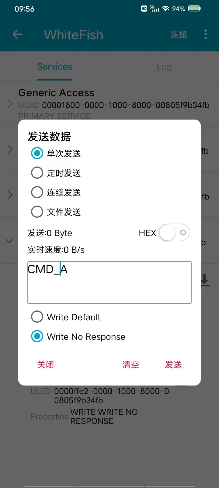
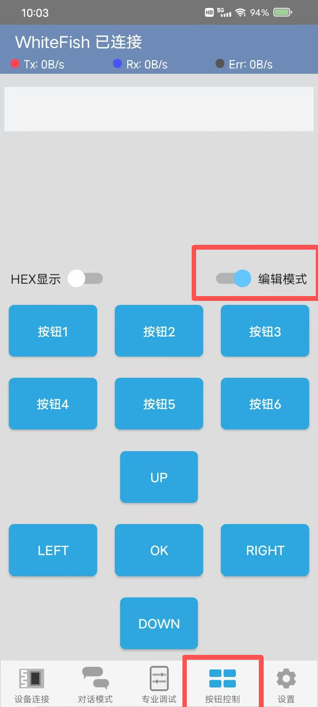
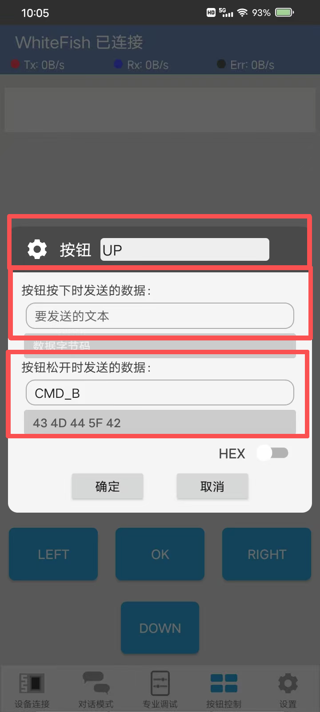
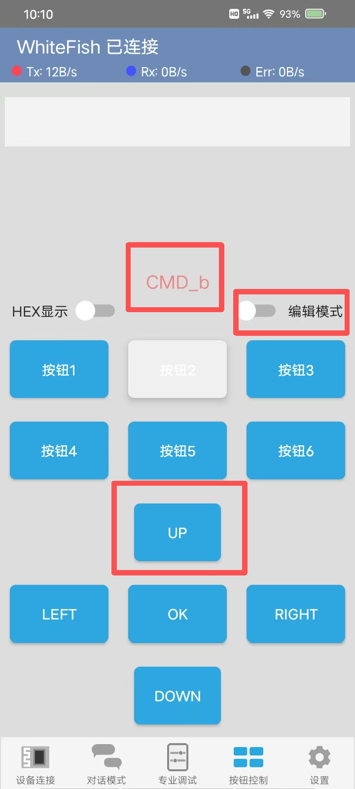

本项目小鱼是一款 兴趣教学 类 产品 ，为中小学生 ，电子 DIY 爱好者 提供 愉快的 手工项目体验。

以下为小鱼的直接上手体验教程：

***

### 安装控制软件

第一步，我们需要准备好 小鱼的控制软件。

小鱼 基于蓝牙协议进行控制，因此，您需要在电脑上或者手机 安装好 蓝牙指令软件 ：例如 BLE调试助手/蓝牙调试器等软件

我们先以 手机 的 蓝牙调试器 为例（安装包已随仓库提供：[软件/蓝牙调试器_v1.95.apk](../软件/蓝牙调试器_v1.95.apk)，该软件来自第三方网络，版权归原作者所有）

安装完成后，您的手机会显示该图标

当然，其他任何的 蓝牙调试软件都是被允许使用的。

***

### 打开开关

由于小鱼采用磁控开关，首先，我们需要准备 胶布和磁铁，并把磁铁粘贴在胶布上

再把胶布粘在小鱼顶部的位置，如下图

如果能听到“咔哒”一声（继电器打开的声音），说明小鱼已正常打开。

***

### 连接小鱼

点击并打开 安装好的 蓝牙软件，扫描蓝牙 并连接上 小鱼的 蓝牙

> 如果蓝牙调试器没有扫描到任何设备，请检查 手机的 定位/蓝牙服务 是否正常开启

连接完成后，软件显示的界面如下图：

> 首次连接 可能需要 输入 PIN ，此时输入 0000 或者 1234 即可

连接上小鱼，之后 打开对话模式，发送指令 `CMD_a` 

如果小鱼 此时鱼尾开始 轻微摆动 ，说明 小鱼系统正常工作。

***

对于一些其他专业的蓝牙调试软件，连接完成之后，显示界面可能如下：

此时，我们选择 `Unknown Service`，选择 上传服务

在此发送 对应的命令即可

### 更多指令

小鱼系统正常工作后，您现在可以尝试发送更多的指令，一些基础的指令如下：

| 命令    | 功能描述         |
| ------- | ---------------- |
| `CMD_S` | 鱼尾回归中心位置 |
| `CMD_R` | 鱼尾持续右方摆动 |
| `CMD_L` | 鱼尾持续左方摆动 |
| `CMD_a` | ±15°摆动（低速） |
| `CMD_A` | ±15°摆动（高速） |
| `CMD_b` | ±30°摆动（低速） |
| `CMD_B` | ±30°摆动（高速） |
| `CMD_c` | ±45°摆动（低速） |
| `CMD_C` | ±45°摆动（高速） |

更多 自定义的高级指令，请阅读文件夹目录下文档：[鱼控制命令说明](鱼控制命令说明.pdf)

***

### 自定义控制按键

频繁的编辑指令文本 对操作可能比较繁琐

对此，您可以打开蓝牙调试的这个界面

首先，我们需要 打开 编辑模式

此时，选中某个按钮，我们可以自定义编辑要发送的指令

此时，我们可以 编辑 按钮的名称 和 按键按下 和 按键松开时 发送的数据 （这里，我们只需要 编辑 按下事件或者松开 事件 其中任意一个 数据文本即可）

注意，请不要打开 `HEX` 发送 ！！！

***

### 关于下水

注意，如果小鱼准备下水，需要 添加额外的防水措施，包括但不限于：

* 添加并调整配重，保证小鱼半浮在水面上，并保持平衡
* 鱼内部的电子器件需要添加密封袋 做 防水保护
* 鱼对接内部旋钮部分建议缠上生料带以添加防水性
* 鱼 外层对接处需要 防水胶布 以确保 系统性防水。